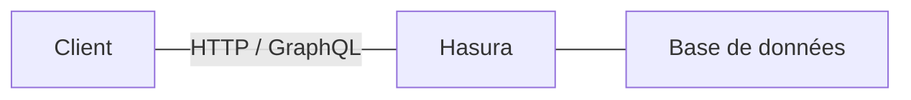
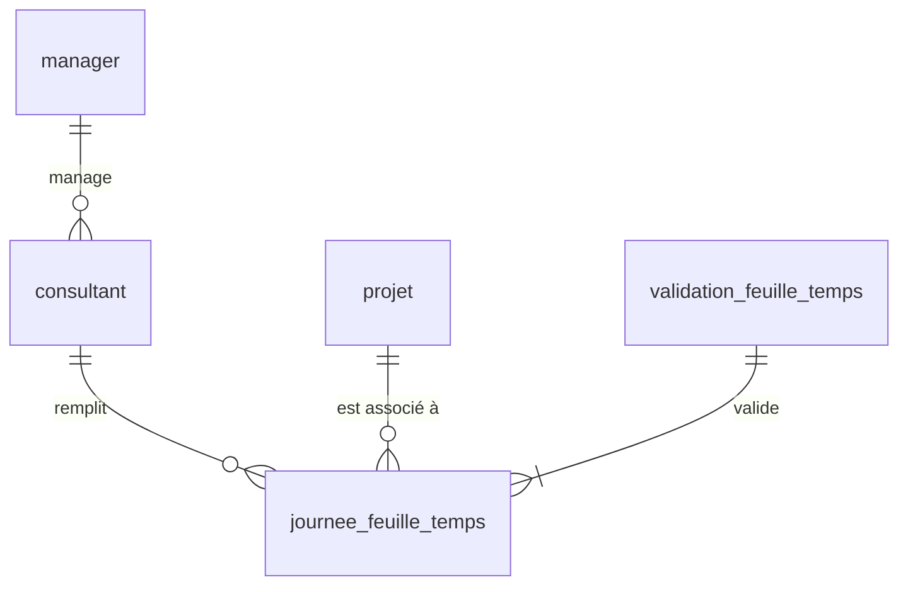

---
# try also 'default' to start simple
theme: seriph
# random image from a curated Unsplash collection by Anthony
# like them? see https://unsplash.com/collections/94734566/slidev
# background: https://source.unsplash.com/collection/94734566/1920x1080
# apply any windi css classes to the current slide
# class: 'text-center'
# https://sli.dev/custom/highlighters.html
highlighter: shiki
# show line numbers in code blocks
lineNumbers: false
# some information about the slides, markdown enabled
info: |
  ## Slidev Starter Template
  Presentation slides for developers.

  Learn more at [Sli.dev](https://sli.dev)
layout: section
---

# Hasura

## Le GraphQL qui Hassure

---
layout: section
---

# GraphQL

---
layout: section
---

# Hasura

---
layout: default
---

# C'est quoi Hasura ?

- Un serveur back-end low code
  - Se connecte à une source de données SQL
  - Expose une API GraphQL configurable et consommable directement depuis un front-end

- Un projet open-source (Apache 2) : Hasura Community Edition
- Un projet commercial
  - Offre managé : Hasura Cloud
  - Offre on-premise : Hasura Enterprise Edition

---
layout: section
---

# L'application d'exemple

---
layout: default
---

# Les petits poneys remplissent leur feuille de temps

| Poney               | Activité                         | 01/09 | 02/09 | 03/09 |
|---------------------|----------------------------------|-------|-------|-------|
| 🦄 Twilight Sparkles | 🎇 Etudier la magie de l'amitié | ✔     |       | ✔      |
|                     | 👸 S'entretenir avec Célestia      |       | ✔     |       |
| 🦄 Applejack         | 🍎 Récolter les pommes          | ✔     | ✔     |       |
|                     | 🍰 Manger des gâteaux           |       |       | ✔     |
| 🦄 Pinkie Pie        | 🧹 Nettoyer la pâtisserie       | ✔      |       |       |
|                     | 🥧 Faire des gâteaux            |       | ✔     |       |
|                     | 🍰 Manger des gâteaux           |       |       | ✔     |
| 🦄 Rainbow Dash        | 🏇 Faire la course       | ✔      | ✔      | ✔      |

---

# Workflow

- Les poneys (les consultants) remplissent leur feuille de temps règulièrement pendant le mois (ou pas)
  - un poney + un jour = une activité
- Un email est envoyé aux poneys tous les 25 du mois pour leur rappeler de remplir la feuille
- Les poneys valident leur feuille pour le mois entier
  - Tous les jours du mois doivent avoir une activité pour pouvoir valider
  - Une feuille validée ne peut pas être modifiée
- Célestia (le manager)
  - peut consulter les feuilles de ses consultants
  - approuvent les feuilles validées
  - vérifie qui n'a pas validé le mois pour pouvoir leur rappeler de le faire
  - veut un export PDF (🤷‍♂️)

---

# Modélisation

---
layout: section
---

# Construisons !

---
layout: section
---

# Authentification

---
layout: section
---

# Déploiement

---
layout: section
---

# Sur le terrain
